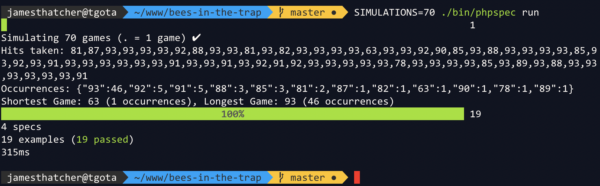

# bees-in-the-trap
A php7/phpspec solution to the Bees in the Trap technical test by [James Thatcher](https://github.com/jthatch) 2020

## Requirements
##### non-docker:
- PHP 7.1 or later, [composer](https://getcomposer.org/)   
##### docker:
- [Make](https://www.gnu.org/software/make/) and [Docker](https://www.docker.com)

## Installation (non-docker):
- `git clone git@github.com:jthatch/bees-in-the-trap.git`
- `cd bees-in-the-trap && cp .env.example .env && composer install`

## Usage
##### non-docker:
- `./beesinthetrap.sh`
- `./beesinthetrap.sh -v`
##### docker:
- `make build`
- `make run`
- `make run-verbose` *(To show verbose output including debugging)*

## Example output
*Playing a small game, note you can change trap size by overriding the env's in `beesinthetrap.sh`* 


*With the verbose flag on (`-v`)*  


*Simulating 70 games and showing the results*  


## Tests
Tests are written in BDD style using `phpspec`.  

>The game simulator can be accessed by passing `SIMULATIONS=n` as an argument before initiating `phpspec`. 
>
>The results of each simulation will be aggregated and displayed below, including hit count distributions and the game with the least and most amount of hits.  
>  
>For the record, the lowest possible hit count (e.g. hitting the queen **every single time**) is **13 hits**. The lowest I've managed to get is *47 hits* with 50'000 simulations.   
##### non-docker:
- `./bin/phpspec run --format=pretty`
- `SIMULATIONS=10000 ./bin/phpspec run --format=pretty`
##### docker:
- `make test`

## Make commands
I've added a few extra `make` commands to make local dev and testing easier.

```bash
help                           This help.
build                          Build docker image
run                            Run the game
test                           Run the testsuite
run-verbose                    Run in container using verbose
run-dev                        Run using local workspace
test-dev                       Run tests using local workspace
clean                          Clean old docker images not attached
```